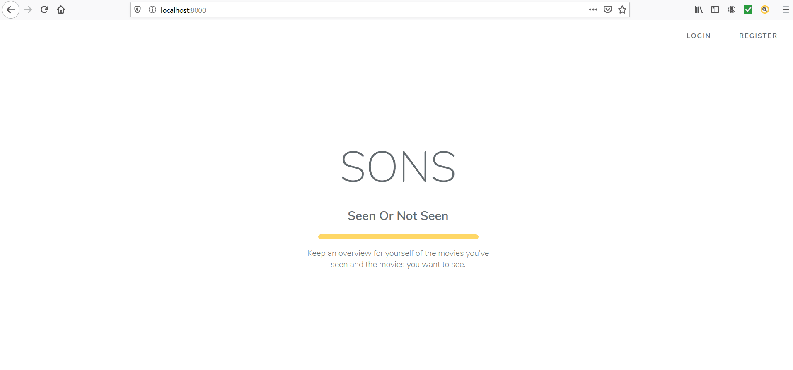

# SONS - Seen Or Not Seen

## About
Seen Or Not Seen. Keep an overview for yourself of the movies you've seen and the movies you want to see. This is a web application build in [Laravel](https://github.com/laravel/laravel) which is a large PHP framework.

## Run the API
*Note: php, composer and laravel need to be installed on your device. Laravel has a lot of video tutorials on Laravel, PHP, unit testing, etc on [Laracast](https://laracasts.com).*
*Setting up the local machine is well explained in the [first section of the Laravel-6-from-scratch serie](https://laracasts.com/series/laravel-6-from-scratch).*
```
php artisan migrate:fresh
php artisan db:seed
php artisan serve
```

## Demo
- Demo (50seconds)

